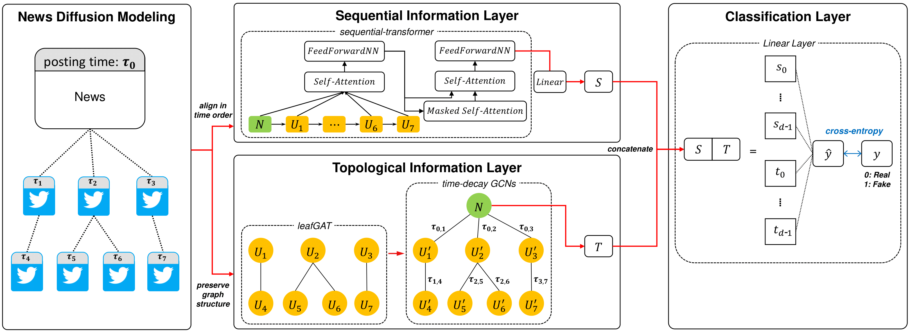

# TSNN: Topological and Sequential Neural Network Model for Detecting Fake News
This repository contains official implementation code of paper **Topological and Sequential Neural Network Model for Detecting Fake News** [(link)](https://ieeexplore.ieee.org/document/10363175).

## Overview

This model, named TSNN, is a Topological and Sequential Neural Network model to detect fake news by news diffusion network. Fake news can be easily propagated through social media and cause negative societal effects. We introduce deep learning based automatic fake news detection model with capturing diffusion pattern on social network.




## Getting Started

### Prerequisites

- Python 3.8
- To use this model, you need to install [PyTorch](https://pytorch.org/) and [PyTorch Geometric](https://pytorch-geometric.readthedocs.io/en/latest/notes/installation.html).
- Dependencies listed in the `requirements.txt` file.

### Installation
Clone the repository and install dependencies:

  ```bash
  git clone https://github.com/dongin1009/TSNN-DFN.git
  cd TSNN
  # Install library
  pip install -r requirements.txt
  ```

## Get the Data
Our model trains and evaluates on `PolitiFact` and `GossipCop`, which are the benchmark datasets for Fake News Detection. You can download the benchmark datasets in graph-structured data from the [GNN-FakeNews project](https://github.com/safe-graph/GNN-FakeNews?tab=readme-ov-file#datasets).

To run the model, you should get data and construct the following formation.
```bash
TSNN-DFN/
├── data/
│   ├── gos_id_time_mapping.pkl
│   ├── gos_id_twitter_mapping.pkl
│   ├── gos_news_list.txt
│   ├── pol_id_time_mapping.pkl
│   ├── pol_id_twitter_mapping.pkl
│   ├── pol_news_list.txt
│   └── gossipcop/raw/
│   │   ├── A.txt
│   │   ├── graph_labels.npy
│   │   ├── new_spacy_feature.npz
│   │   └── node_graph_id.npy
│   └── politifact/raw/
│   │   ├── A.txt
│   │   ├── graph_labels.npy
│   │   ├── new_spacy_feature.npz
└   └   └── node_graph_id.npy
```

## Experiments
After you get data, run code by the following commands. Each dataset is split into training, validation, and test set as 8:1:1. We train model by learning rate in range of *{0.01, 0.005, 0.001, 0.0005}* and select the best performance one. TSNN with *0.001* learning rate shows the best performance in politifact dataset, and TSNN with *0.0005* lr in gossipcop dataset.

### Train and Evaluation
To train and evaluate TSNN, run the `main.py` script. If you check the default hyperparameters and more information, refer main script.
```python
python main.py --dataset politifact --lr 0.001 --use_time_decay_score
```
```python
python main.py --dataset gossipcop --lr 0.0005 --use_time_decay_score
```

### For baselines
We set the other settings and environment as same as TSNN training conditions.
```python
# model_list = ["TSNN", "UPFD-gcn", "UPFD-gat", "UPFD-sage", "UPFD-transformer", "BiGCN", "GCNFN"]
python main.py --dataset {DATASET} --lr {LEARNING RATE} --model 
```

This performance table shows averaged performance on 5 cross-validations and selected to highest result on learning rate variations.
|Model|pol_Acc|pol_F1|gos_acc|gos_F1|
|---|:---:|:---:|:---:|:---:|
|GCNFN|84.81|84.78|95.48|95.42|
|Bi-GCN|82.53|82.45|96.84|96.80|
|UPFD_GCN|82.78|82.71|97.51|97.48|
|UPFD_GAT|81.27|81.25|97.38|97.35|
|UPFD_SAGE|79.75|79.71|97.45|97.43|
|**UPSR*|91.4|91.0|97.7|97.6|
|**TSNN**|**92.15**|**92.11**|**97.91**|**97.88**|

\* *UPSR didn't provide its code, so the indicated are results from its original paper.*

\* *For fair comparison, we set most settings to same with UPSR as possible we can.*
## For ablation study
We conducted ablation studies to validate the 'time-decay GCNs' module and 'sequential information layer' module.
### Time-Decay GCNs

Using the 'minute-based' time-decay function outperforms the 'second-based', and 'no time-decay' functions, and the 'adding depth divide' methods.
|time-decay|pol_Acc|pol_F1|gos_acc|gos_F1|
|---|:---:|:---:|:---:|:---:|
|**minute-based**|**92.15**|**92.11**|**97.91**|**97.88**|
|+ (*w*/ Depth div)|90.62|91.09|97.25|97.27|
|second-based|92.01|91.87|97.85|97.82|
|+ (*w*/ Depth div)|91.14|91.10|97.79|97.81|
|*w*/*o* time-decay|89.62|89.59|97.25|97.21|
|+ (*w*/ Depth div)|90.81|90.59|97.34|97.30|

```python
# with time-decay score / with Depth div
python main.py --dataset {DATASET} --lr {LEARNING RATE} --use_time_decay_score --use_depth_divide
```

### Sequential Information Layer
We selected 'transformer' model as a sequential information layer and compared it with several configurations. The '2 encoder - 2 decoder' of transformer is most effective for capturing news diffusion sequences.
|sequential layer|pol_Acc|pol_F1|gos_acc|gos_F1|
|---|:---:|:---:|:---:|:---:|
|**2enc - 2dec**|**92.15**|**92.11**|**97.91**|**97.88**|
|3enc - 3dec|90.38|90.31|97.01|96.98|
|4enc - 4dec|89.37|89.34|97.10|97.07|
|4enc only|91.65|91.61|97.44|97.41|
|seq-LSTM|91.39|91.34|97.09|97.05|
|seq-GRU|91.14|91.10|97.05|97.01|

```python
# seq_layer_type = ["transformer", "transformer_encoder", "lstm", "gru"]
# num_seq_layers = 2
python main.py --dataset {DATASET} --lr {LEARNING RATE} --seq_layer_type {SEQ_TYPE} --num_seq_layers {NUM}
```

## Cite
```bibtex
@article{jung2023topological,
  title={Topological and Sequential Neural Network Model for Detecting Fake News},
  author={Jung, Dongin and Kim, Eungyeop and Cho, Yoon-Sik},
  journal={IEEE Access},
  year={2023},
  publisher={IEEE}
}
```
## Acknowledgements
Our code and source data are based on [GNN-Fakenews](https://github.com/safe-graph/GNN-FakeNews).
## Contact
If you have any questions, please contact us via email: `dongin1009@gmail.com`